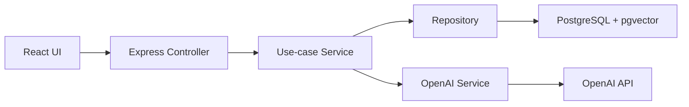

# Architecture Notes

## Request Flow

## Why PostgreSQL + pgvector

This project keeps relational document metadata and vector search in one transactional database. That is a pragmatic starting point for compliance workflows because document status, metadata filters, chunk rows, and query logs can be joined and audited with SQL.

## Why Page-Aware Chunks

Compliance answers need citations that users can verify. Chunking per page makes citations precise and keeps page references available without a separate span-mapping system.

## Why Shared Contracts

The `@cdc/contracts` package exports Zod schemas and TypeScript types used by both the API and the React client. Runtime validation protects HTTP boundaries, while inferred TypeScript types keep frontend and backend payloads synchronized.

## Extension Points

- Add metadata filters in `ChunkRepository.searchByEmbedding`.
- Add reranking between vector retrieval and RAG prompting.
- Add streaming in `OpenAiService.generateGroundedAnswer`.
- Add tool calling by turning `RagService` into an agent orchestration service.
- Add richer evals in `EvaluationService`.
